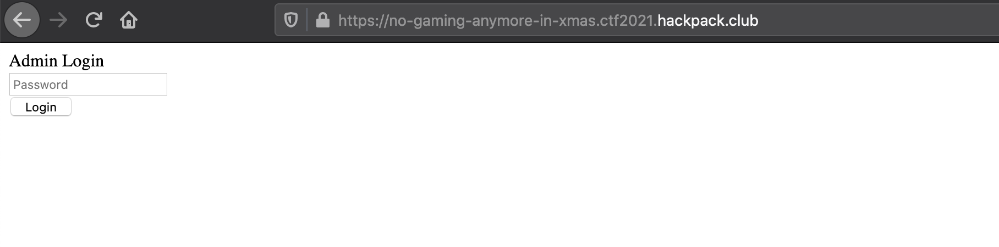
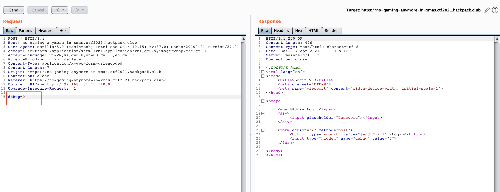
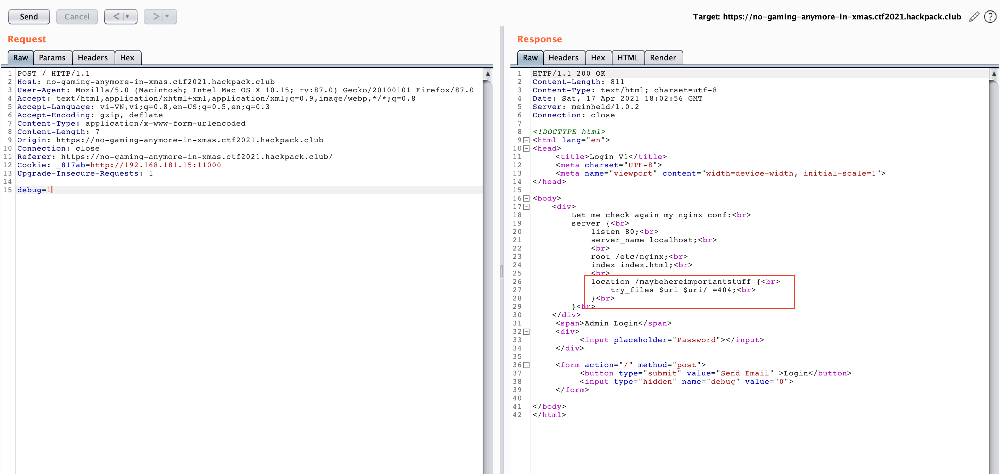
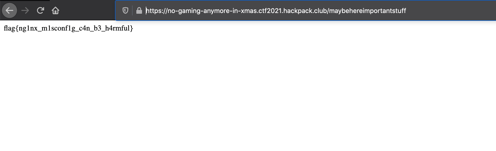

## challenge

Can you login as admin? http://no-gaming-anymore-in-xmas.ctf2021.hackpack.club

## solve

I have a website

I try login and intercept with burpsuite

I change `debug = 1`, and repeat request

So, website have URI `maybehereimportantstuff`, i access to it. I got a flag.

Flag is: `flag{ng1nx_m1sconf1g_c4n_b3_h4rmful}`
