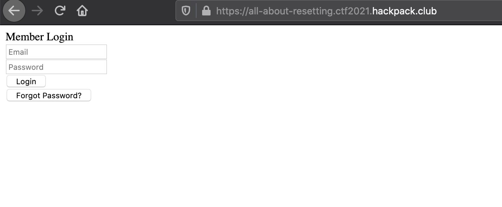
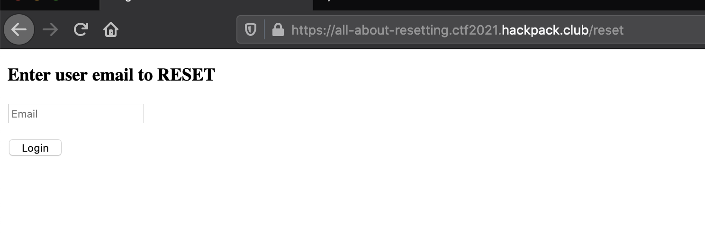
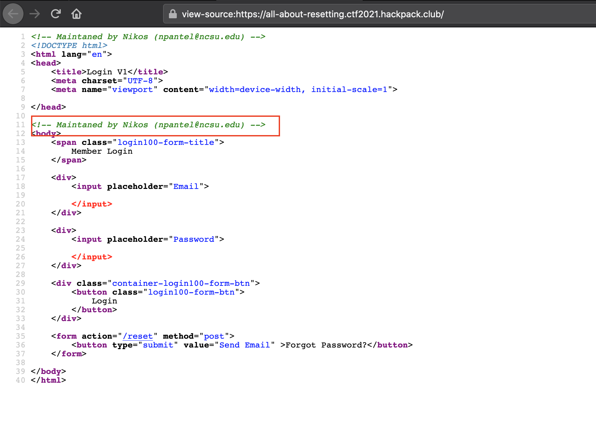
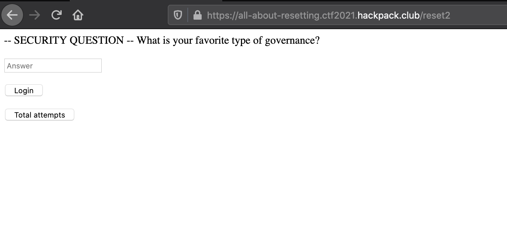
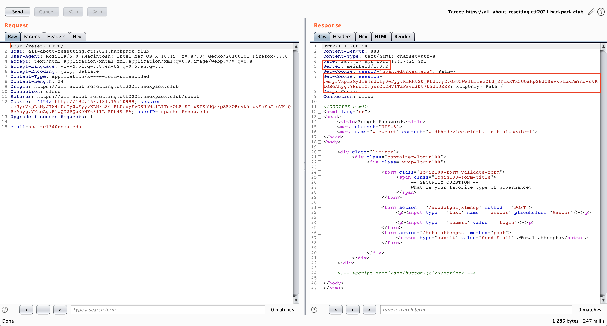
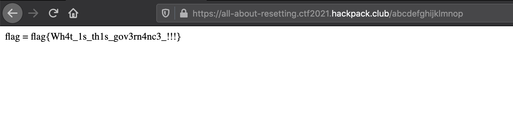

## challenge

Who can guess my password or.. http://all-about-resetting.ctf2021.hackpack.club

## solve

I have a website



Have reset password function



So, i need a email to reset password, i try inspect home page and have a email `npantel@ncsu.edu`



I try reset password with mail `npantel@ncsu.edu`.



Ok, so i need answer `SECURITY QUESTION`

Intercept with bupsuite, i have cookie: `.eJyrVkpLzMyJT84rUbIy0wFyyvKLMktS0_PLUovyEvOSU5WslLITszOLS_KTixKTK5UQakpSE3OBsvk5lbkFmYnJ-cVKtQBeAhyg.YHsccg.WiDP0w4_NiOEhNTIZWfB6HwhVlM`

prefix `.` denotes that it is compressed 



And see server return header `Server: meinheld/1.0.2`, so the website run python.

I try, decompress with python.

```py
import zlib
import base64

j = zlib.decompress(base64.urlsafe_b64decode(b"eJyrVkpLzMyJT84rUbIy0wFyyvKLMktS0_PLUovyEvOSU5WslLITszOLS_KTixKTK5UQakpSE3OBsvk5lbkFmYnJ-cVKtQBeAhyg"))

print(j)
```

Run this, i have result

```
b'{"fail_cnt":6,"favoritegovernance":"kakistocracy","favoriteteam":"olympiacos"}'
```

So, `favoritegovernance is kakistocracy`, this is SECURITY QUESTION .

I submit them, and i got a flag



Flag is: `flag{Wh4t_1s_th1s_gov3rn4nc3_!!!}`
