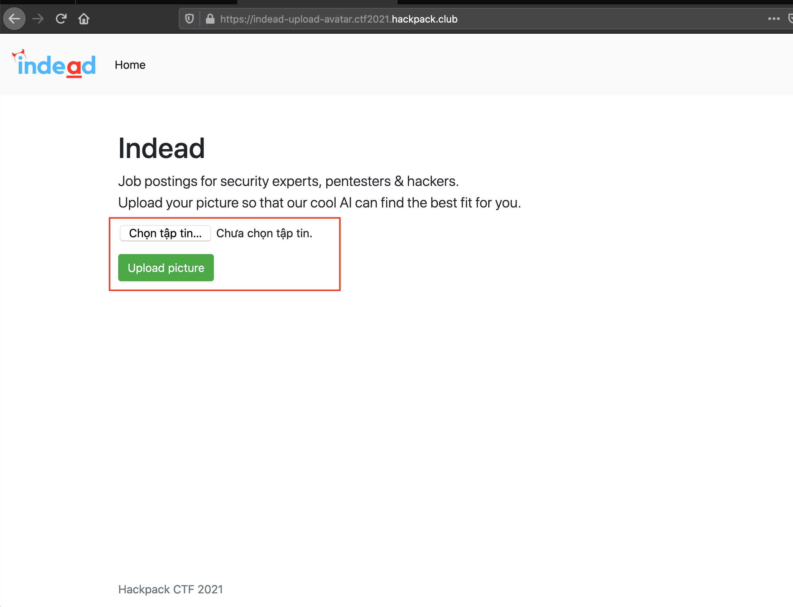
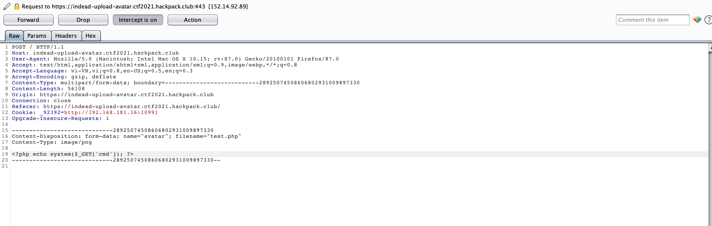

## challenge

Job posting website for security experts, pentesters and hackers. http://indead-upload-avatar.ctf2021.hackpack.club

## solve

Go to url: http://indead-upload-avatar.ctf2021.hackpack.club

Web have upload file function



This website is programmed in php language


I try upload php shell file 



But not allow


**In php**: The PHPS file type is primarily associated with PHP Source by The PHP Group. Generally, PHP files will get interpreted by the Web server and PHP executable, and you will never see the code behind the PHP file. If you make the file extension .PHPS, a properly-configured server will output a color-formated version of the source instead of the HTML that would normally be generated. Not all servers are so configured.

I try access to: https://indead-upload-avatar.ctf2021.hackpack.club/index.phps and see source code bellow


I continue access to: https://indead-upload-avatar.ctf2021.hackpack.club/core.phps


I've got all the source code, next step is source code review


In *core.php* using getimagesize() function to check if image file is a actual image or fake image

With getimagesize() function if i upload a file GIF, it just check GIF file header.

And, The file, after being uploaded, will be saved to the directory **very_long_directory_path** 

**GIF89a; header**: GIF89a is a GIF file header. If uploaded content is being scanned, sometimes the check can be fooled by putting this header item at the top of shellcode:

```php
GIF89a;
<?php
    echo system($_GET['cmd']); # shellcode goes here
?>
```

Ok, I tried uploading it again with shellcode.


Bigo! Upload successful. I got a webshell.

I access to: https://indead-upload-avatar.ctf2021.hackpack.club/very_long_directory_path/test.php?cmd=ls


Finally, get flag in `/var/www/` with path: `/var/www/flag.txt`


Flag is: `flag{y3t_an0ther_file_uplo@d_vuln}flag{y3t_an0ther_file_uplo@d_vuln}`