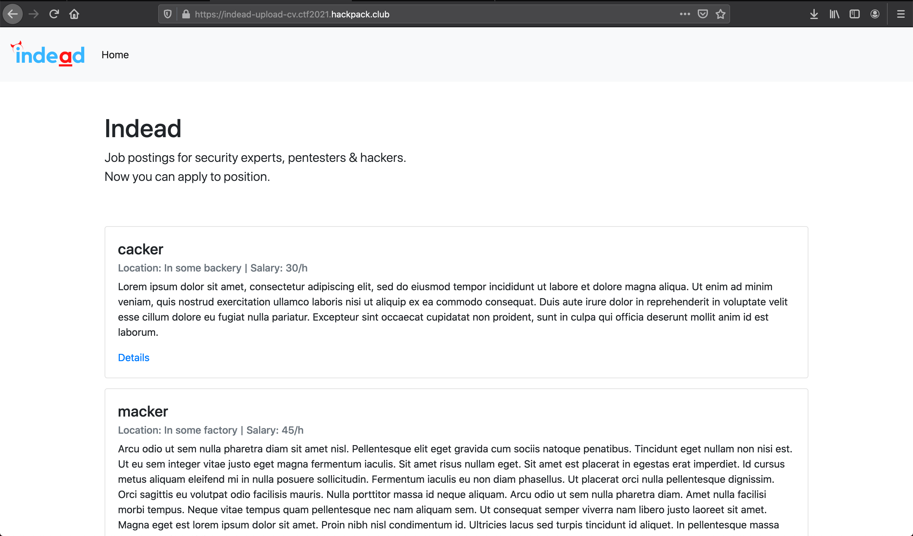
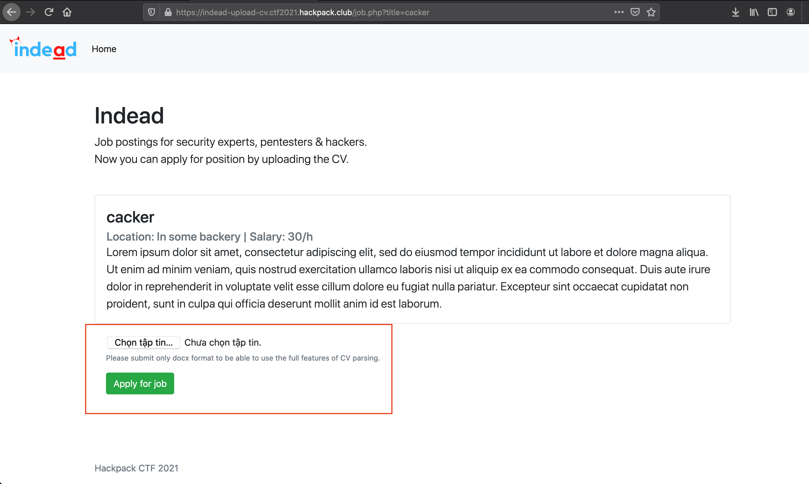
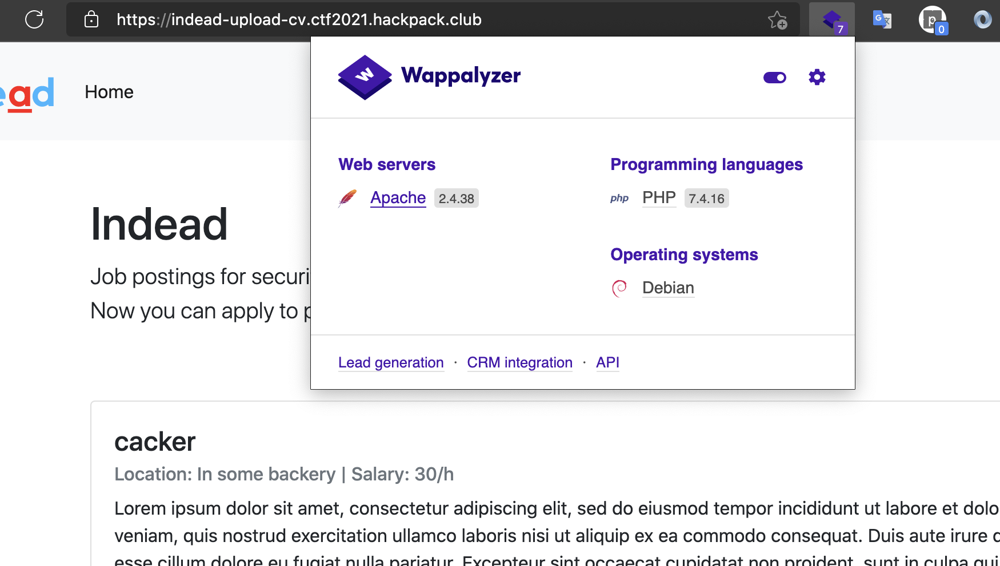
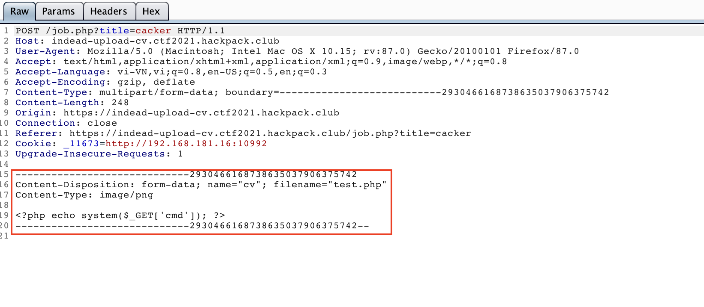
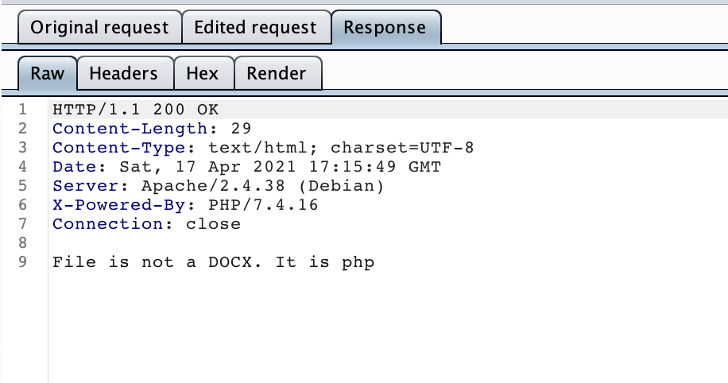
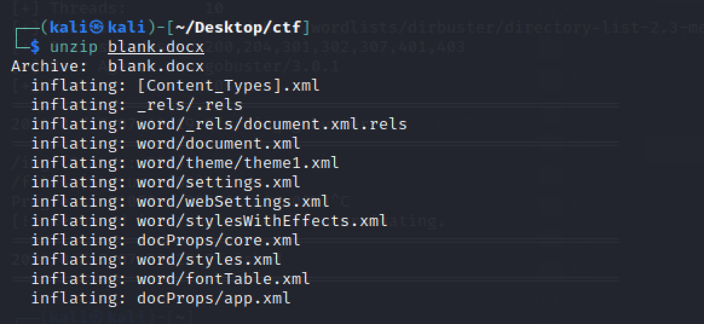
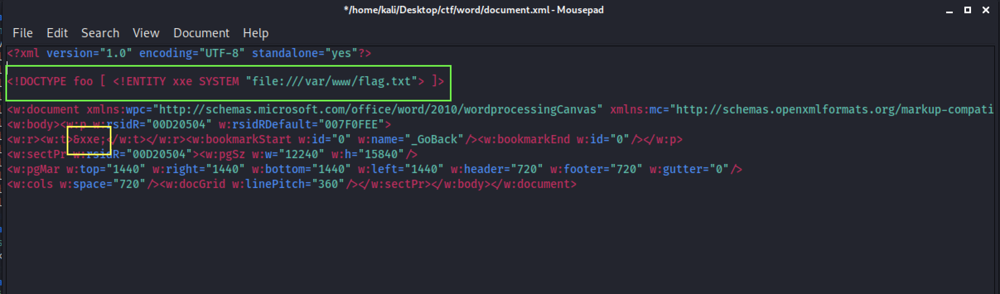
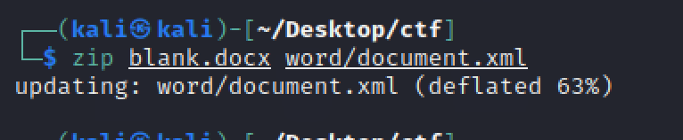
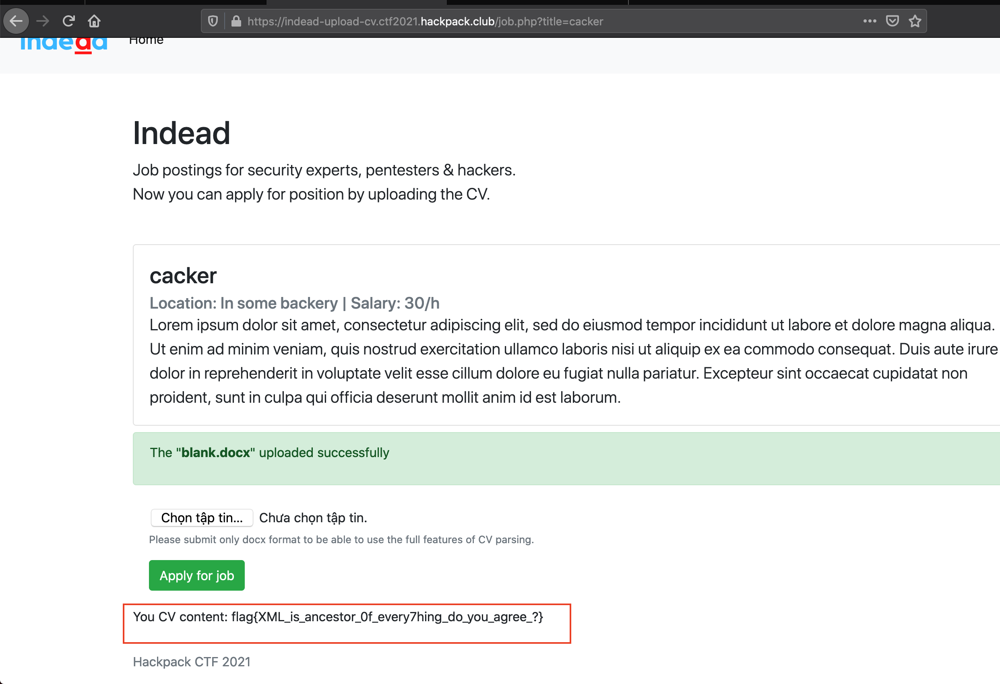

## challenge

Job posting website for security experts, pentesters and hackers. Now you can apply by uploading CV. http://indead-upload-cv.ctf2021.hackpack.club

## solve

Go to url: http://indead-upload-cv.ctf2021.hackpack.club

Click button **Details** in site, the site redirect to upload file function bellow:

The website is php

I try upload php shell file

And, Website return

So we can only upload DOCX files

`A Docx file is mostly just zipped up xml files. We need to unzip the blank.docx file and modify the contents in “word/document.xml”. Then, save our changes back to blank.docx.`

Two modifications are needed in document.xml. For the first modification, add this line under line one to read /var/www/flag.txt:

That’s it! The modifications to document.xml need to be saved to the blank.docx file now.

Once the malicious .docx file is uploaded then the contents of /var/www/flag.txt can be read.

Flag is: `flag{XML_is_ancestor_0f_every7hing_do_you_agree_?} `